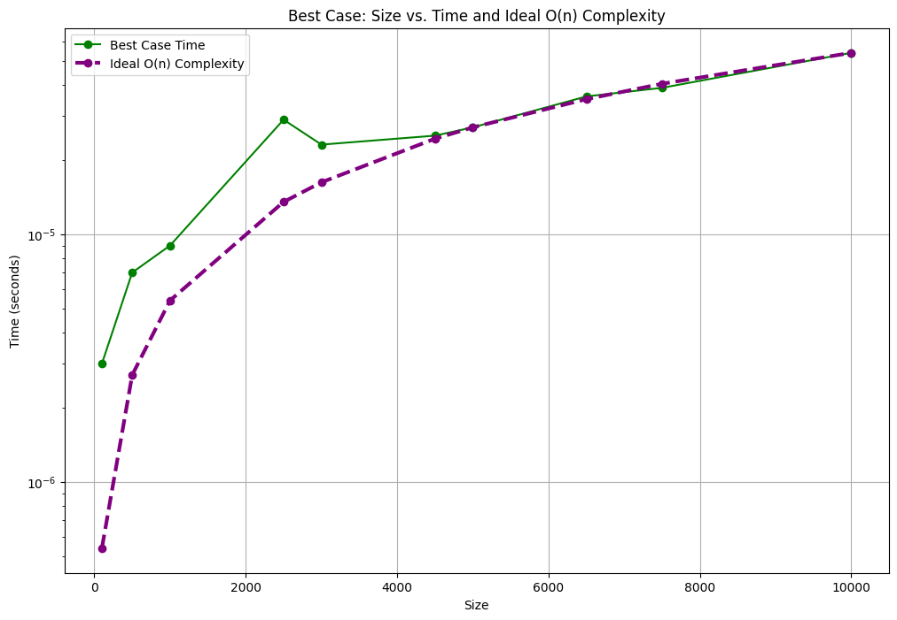
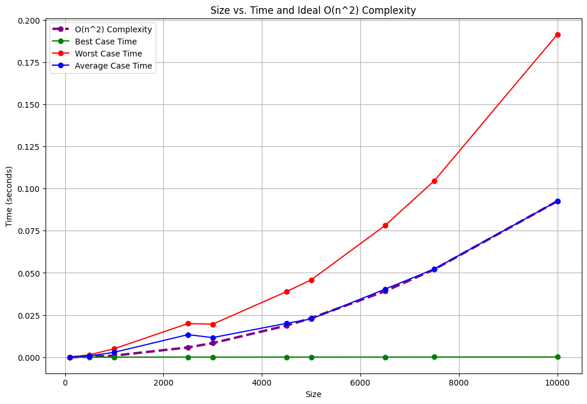
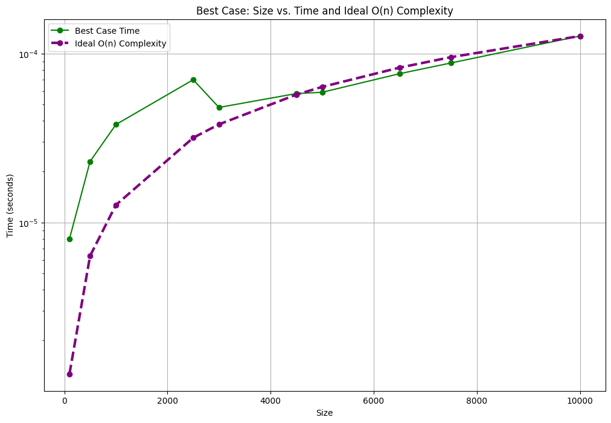
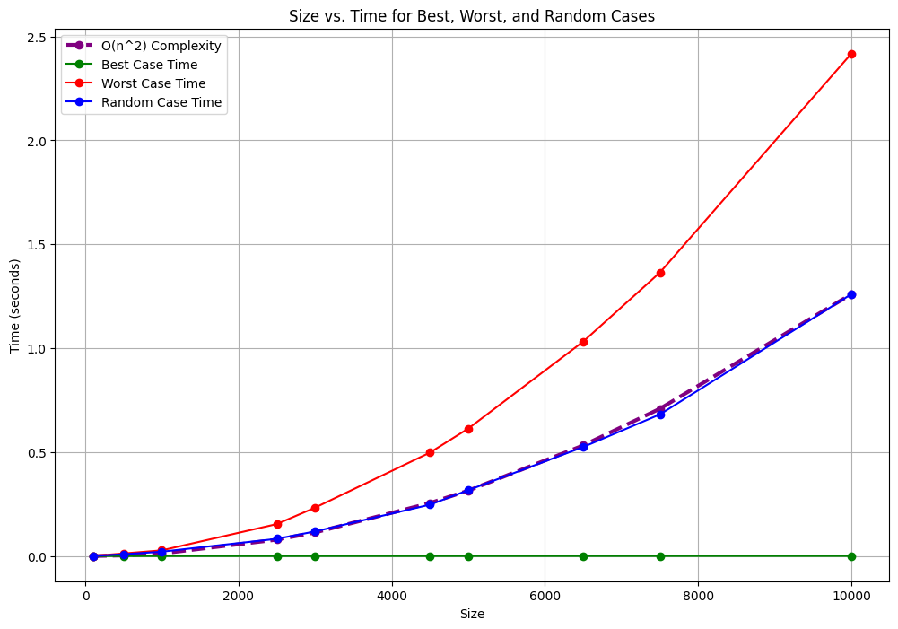
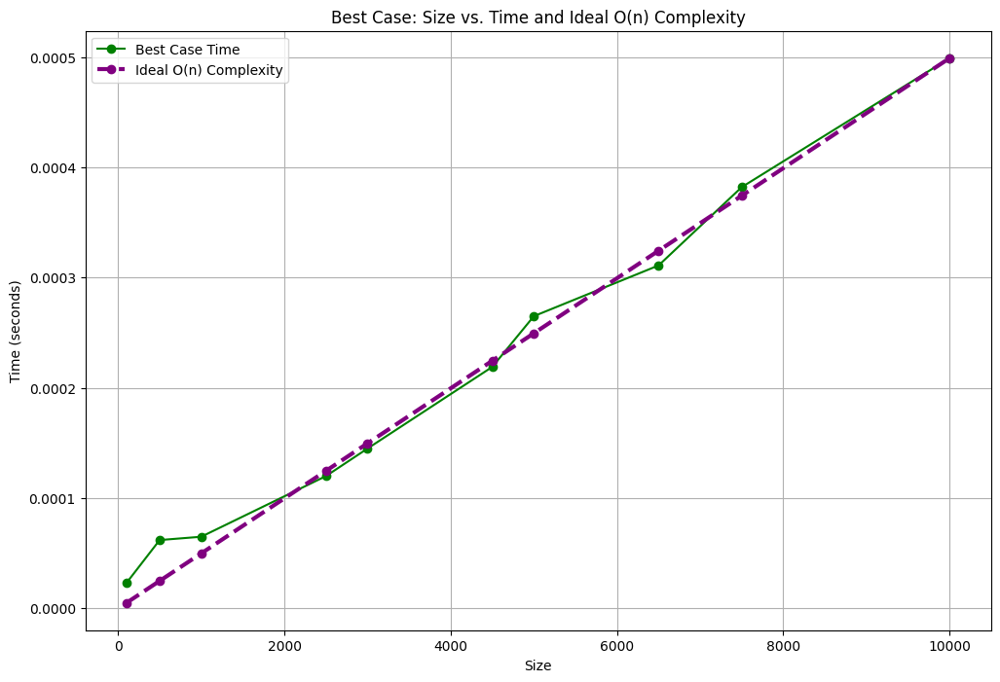

# Lab 1: Insertion Sort 29/7/2024
## [1. Insertion Sort for letters](q1/q1.cpp)
[Question.](q1/Question-1.md)

- Results from different Input Sizes

    - Contents of best_case_results.csv ---> Already Sorted Vector:
        |   Size |   Time (seconds) |
        |-------:|-----------------:|
        |    100 |          3e-06   |
        |    500 |          7e-06   |
        |   1000 |          9e-06   |
        |   2500 |          2.9e-05 |
        |   3000 |          2.3e-05 |
        |   4500 |          2.5e-05 |
        |   5000 |          2.7e-05 |
        |   6500 |          3.6e-05 |
        |   7500 |          3.9e-05 |
        |  10000 |          5.4e-05 |

    - Contents of worst_case_results.csv  Already Sorted in Descending Order Vector:
        |   Size |   Time (seconds) |
        |-------:|-----------------:|
        |    100 |         6.7e-05  |
        |    500 |         0.000709 |
        |   1000 |         0.003965 |
        |   2500 |         0.020923 |
        |   3000 |         0.027296 |
        |   4500 |         0.04177  |
        |   5000 |         0.049136 |
        |   6500 |         0.083296 |
        |   7500 |         0.110265 |
        |  10000 |         0.206866 |

    - Contents of random_results.csv ---> Randomly Generated Vector (Average case):
        |   Size |   Time (seconds) |
        |-------:|-----------------:|
        |    100 |         4.6e-05  |
        |    500 |         0.000781 |
        |   1000 |         0.001545 |
        |   2500 |         0.012493 |
        |   3000 |         0.013602 |
        |   4500 |         0.02135  |
        |   5000 |         0.025149 |
        |   6500 |         0.042958 |
        |   7500 |         0.060252 |
        |  10000 |         0.113086 |

     
     
     
     
     
     
    

        
        
    

    ### Conclusion: The above graphs are the results with varying input sizes. The scale of Best case graph was very small , hence refer the best case plotted separately

## [2. Insertion sort with Negative numbers](q2/q2.cpp)
[Question.](q2/Question-2.md)

- Results from Different Input Sizes
    - Contents of best_case_results.csv Already Sorted Vector:
        |   Size |   Time (seconds) |
        |-------:|-----------------:|
        |    100 |         8e-06    |
        |    500 |         2.3e-05  |
        |   1000 |         3.8e-05  |
        |   2500 |         7e-05    |
        |   3000 |         4.8e-05  |
        |   4500 |         5.8e-05  |
        |   5000 |         5.9e-05  |
        |   6500 |         7.6e-05  |
        |   7500 |         8.8e-05  |
        |  10000 |         0.000127 |
    - Contents of worst_case_results.csv Already Sorted in Descending Order Vector:
        |   Size |   Time (seconds) |
        |-------:|-----------------:|
        |    100 |         6.5e-05  |
        |    500 |         0.001399 |
        |   1000 |         0.005    |
        |   2500 |         0.01993  |
        |   3000 |         0.019559 |
        |   4500 |         0.038872 |
        |   5000 |         0.045823 |
        |   6500 |         0.078043 |
        |   7500 |         0.10452  |
        |  10000 |         0.191383 |
    - Contents of random_results.csv Randomly Generated Vector (Average case):
        |   Size |   Time (seconds) |
        |-------:|-----------------:|
        |    100 |         4.9e-05  |
        |    500 |         0.000748 |
        |   1000 |         0.002883 |
        |   2500 |         0.013356 |
        |   3000 |         0.011603 |
        |   4500 |         0.020048 |
        |   5000 |         0.022643 |
        |   6500 |         0.04032  |
        |   7500 |         0.052262 |
        |  10000 |         0.092513 |
     
     
     
     
     
     

    

        
        
    

    ### Conclusion: The above graphs are the results with varying input sizes. The scale of Best case graph was very small , hence refer the best case plotted separately    

## [3. Insertion Sort- sorting the points based on the distance from the leftmost-bottom point](q3/q3new.cpp)
[Question.](q3/Question-3.md)

- Worst Case:

<table border="1" class="dataframe">
  <thead>
    <tr style="text-align: right;">
      <th></th>
      <th>Size</th>
      <th>Time (seconds)</th>
    </tr>
  </thead>
  <tbody>
    <tr>
      <th>0</th>
      <td>100</td>
      <td>0.000690</td>
    </tr>
    <tr>
      <th>1</th>
      <td>500</td>
      <td>0.012638</td>
    </tr>
    <tr>
      <th>2</th>
      <td>1000</td>
      <td>0.027566</td>
    </tr>
    <tr>
      <th>3</th>
      <td>2500</td>
      <td>0.153910</td>
    </tr>
    <tr>
      <th>4</th>
      <td>3000</td>
      <td>0.232938</td>
    </tr>
    <tr>
      <th>5</th>
      <td>4500</td>
      <td>0.498053</td>
    </tr>
    <tr>
      <th>6</th>
      <td>5000</td>
      <td>0.613492</td>
    </tr>
    <tr>
      <th>7</th>
      <td>6500</td>
      <td>1.031910</td>
    </tr>
    <tr>
      <th>8</th>
      <td>7500</td>
      <td>1.363670</td>
    </tr>
    <tr>
      <th>9</th>
      <td>10000</td>
      <td>2.417410</td>
    </tr>
  </tbody>
</table>

-  Average(Random) Case:

<table border="1" class="dataframe">
  <thead>
    <tr style="text-align: right;">
      <th></th>
      <th>Size</th>
      <th>Time (seconds)</th>
    </tr>
  </thead>
  <tbody>
    <tr>
      <th>0</th>
      <td>100</td>
      <td>0.000533</td>
    </tr>
    <tr>
      <th>1</th>
      <td>500</td>
      <td>0.009061</td>
    </tr>
    <tr>
      <th>2</th>
      <td>1000</td>
      <td>0.021099</td>
    </tr>
    <tr>
      <th>3</th>
      <td>2500</td>
      <td>0.083002</td>
    </tr>
    <tr>
      <th>4</th>
      <td>3000</td>
      <td>0.118519</td>
    </tr>
    <tr>
      <th>5</th>
      <td>4500</td>
      <td>0.247325</td>
    </tr>
    <tr>
      <th>6</th>
      <td>5000</td>
      <td>0.317074</td>
    </tr>
    <tr>
      <th>7</th>
      <td>6500</td>
      <td>0.524724</td>
    </tr>
    <tr>
      <th>8</th>
      <td>7500</td>
      <td>0.681365</td>
    </tr>
    <tr>
      <th>9</th>
      <td>10000</td>
      <td>1.260080</td>
    </tr>
  </tbody>
</table>

- Best Case:

<table border="1" class="dataframe">
  <thead>
    <tr style="text-align: right;">
      <th></th>
      <th>Size</th>
      <th>Time (seconds)</th>
    </tr>
  </thead>
  <tbody>
    <tr>
      <th>0</th>
      <td>100</td>
      <td>0.000023</td>
    </tr>
    <tr>
      <th>1</th>
      <td>500</td>
      <td>0.000062</td>
    </tr>
    <tr>
      <th>2</th>
      <td>1000</td>
      <td>0.000065</td>
    </tr>
    <tr>
      <th>3</th>
      <td>2500</td>
      <td>0.000120</td>
    </tr>
    <tr>
      <th>4</th>
      <td>3000</td>
      <td>0.000145</td>
    </tr>
    <tr>
      <th>5</th>
      <td>4500</td>
      <td>0.000219</td>
    </tr>
    <tr>
      <th>6</th>
      <td>5000</td>
      <td>0.000265</td>
    </tr>
    <tr>
      <th>7</th>
      <td>6500</td>
      <td>0.000311</td>
    </tr>
    <tr>
      <th>8</th>
      <td>7500</td>
      <td>0.000382</td>
    </tr>
    <tr>
      <th>9</th>
      <td>10000</td>
      <td>0.000499</td>
    </tr>
  </tbody>
</table>

- Graphs
    

        
        
    

    ### Conclusion: The above graphs are the results with varying input sizes. The scale of Best case graph was very small , hence refer the best case plotted separately    