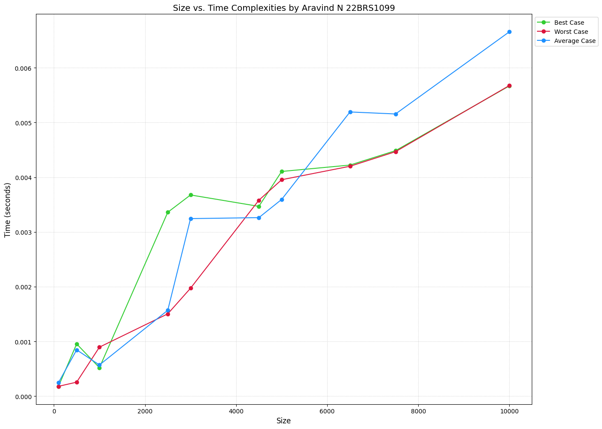
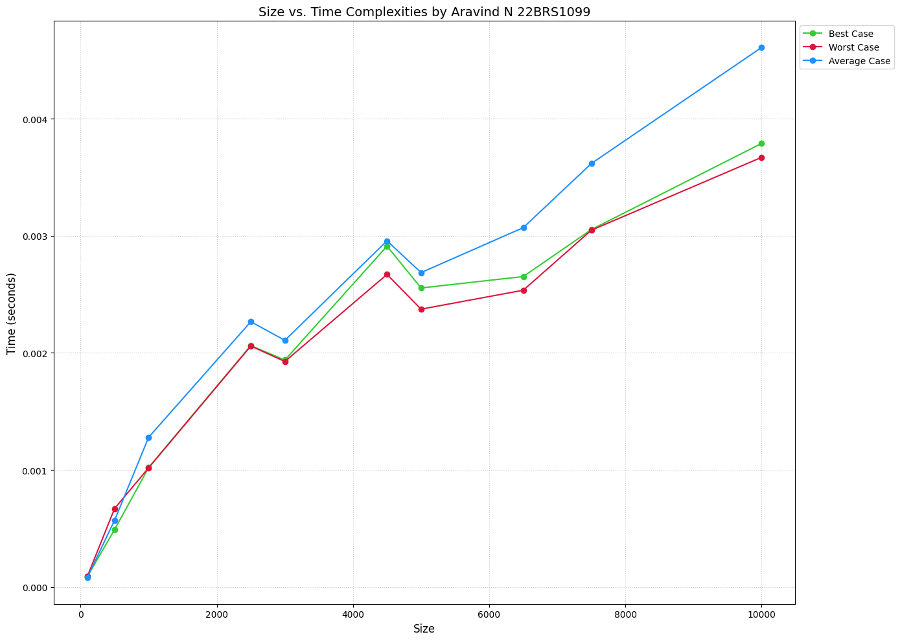
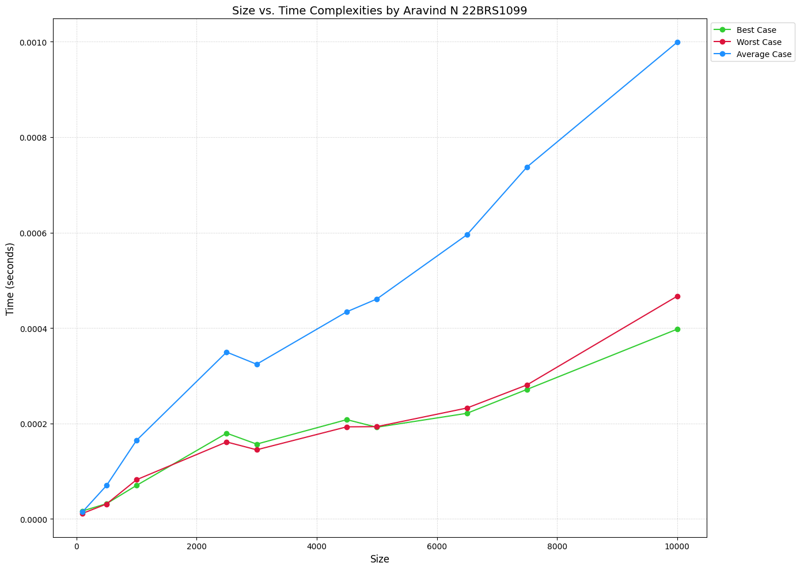
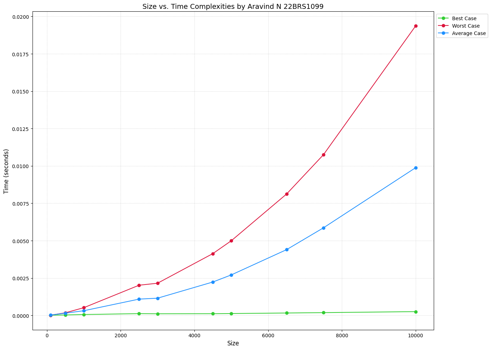
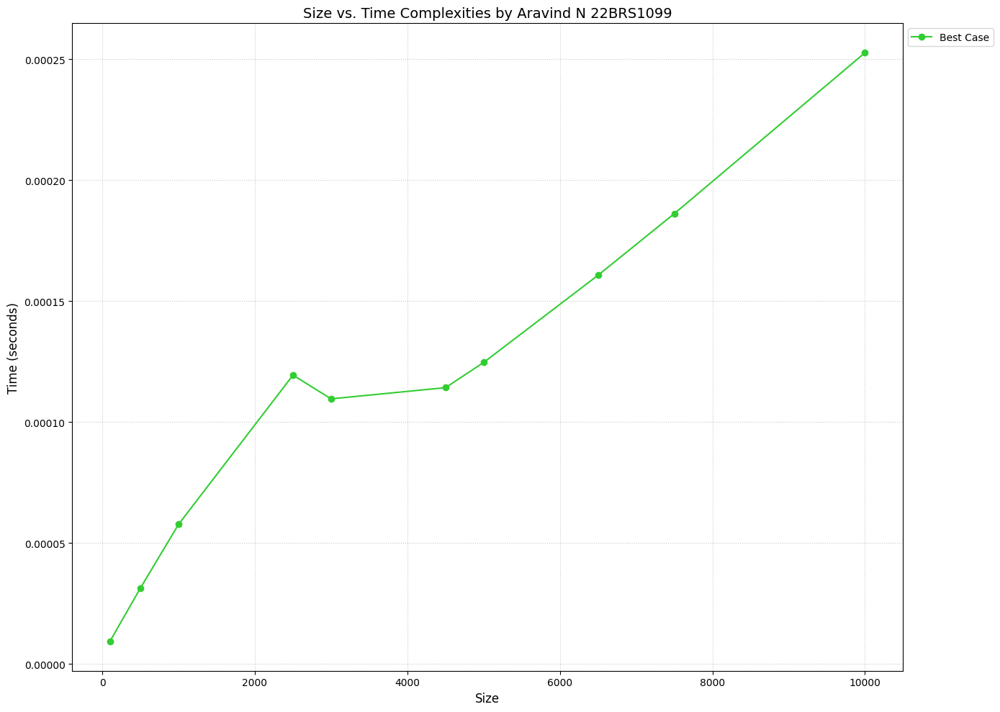
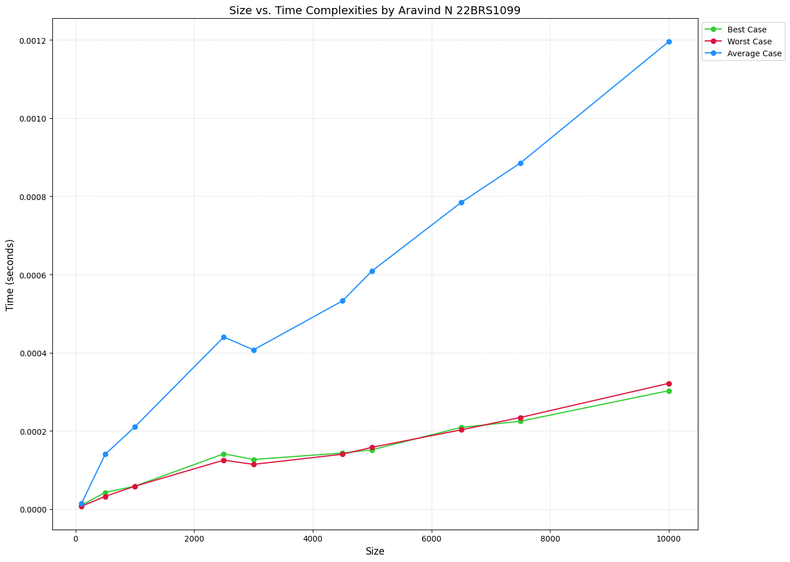

<h1 style="color:red;text-align:right">Aravind N 22BRS1099</h1>

# Lab 2: Merge Sort and DCC 5/8/2024

## Refernce Graph with all the Big O notations

## [1. Merge-sort algorithm without any sentinels.](q1/mergeWithoutSenti.cpp)
[Question.](q1/Question.md)

- Results from different Input Sizes
    - Contents of best_case_results.csv ---> Already Sorted Vector:
        |   Size |   Time (seconds) |
        |-------:|-----------------:|
        |    100 |      0.000178959 |
        |    500 |      0.000955833 |
        |   1000 |      0.000520708 |
        |   2500 |      0.00335979  |
        |   3000 |      0.00367613  |
        |   4500 |      0.00346771  |
        |   5000 |      0.00410525  |
        |   6500 |      0.00422204  |
        |   7500 |      0.00448546  |
        |  10000 |      0.00566888  |
    - Contents of worst_case_results.csv ---> Already Sorted in Descending Order Vector:
        |   Size |   Time (seconds) |
        |-------:|-----------------:|
        |    100 |      0.000180583 |
        |    500 |      0.000256791 |
        |   1000 |      0.000896416 |
        |   2500 |      0.0015045   |
        |   3000 |      0.00197275  |
        |   4500 |      0.00358029  |
        |   5000 |      0.00395442  |
        |   6500 |      0.00420004  |
        |   7500 |      0.00446667  |
        |  10000 |      0.00567608  |
    - Contents of random_results.csv ---> Randomly Generated Vector (Average case):
        |   Size |   Time (seconds) |
        |-------:|-----------------:|
        |    100 |      0.000246208 |
        |    500 |      0.000846834 |
        |   1000 |      0.000570958 |
        |   2500 |      0.00156958  |
        |   3000 |      0.003244    |
        |   4500 |      0.003262    |
        |   5000 |      0.00359429  |
        |   6500 |      0.00519225  |
        |   7500 |      0.00515546  |
        |  10000 |      0.00665696  |
    

The graph shows the time complexity of an algorithm with best, worst, and average cases compared to standard complexity classes. 

- **Best Case**: Appears to follow O(n), as it closely aligns with the linear complexity line.
- **Worst Case**: Likely O(n log n), as it follows the curve similar to the O(n log n) line.
- **Average Case**: Also seems to be O(n log n), as it is near the same curve as the worst case.

These approximations are based on the visual alignment of the plotted lines with the ideal complexity lines.

## [2. Merge-sort algorithm with minimum length subarrays](q2/modifiedmerge.cpp)
[Question.](q2/Question.md)

- Results from different Input Sizes
    - Contents of best_case_results.csv ---> Already Sorted Vector:
        |   Size |   Time (seconds) |
        |-------:|-----------------:|
        |    100 |      8.8333e-05  |
        |    500 |      0.000491042 |
        |   1000 |      0.00102004  |
        |   2500 |      0.00206204  |
        |   3000 |      0.001939    |
        |   4500 |      0.00291192  |
        |   5000 |      0.00255483  |
        |   6500 |      0.00265212  |
        |   7500 |      0.00305358  |
        |  10000 |      0.00378987  |

    - Contents of worst_case_results.csv ---> Already Sorted in Descending Order Vector:
        |   Size |   Time (seconds) |
        |-------:|-----------------:|
        |    100 |      9.05e-05    |
        |    500 |      0.000670375 |
        |   1000 |      0.00101817  |
        |   2500 |      0.00205904  |
        |   3000 |      0.00192671  |
        |   4500 |      0.00267038  |
        |   5000 |      0.00237379  |
        |   6500 |      0.00253525  |
        |   7500 |      0.00304821  |
        |  10000 |      0.00367079  |

    - Contents of random_results.csv ---> Randomly Generated Vector (Average case):
        |   Size |   Time (seconds) |
        |-------:|-----------------:|
        |    100 |      8.1875e-05  |
        |    500 |      0.000569958 |
        |   1000 |      0.00127908  |
        |   2500 |      0.00226654  |
        |   3000 |      0.00210746  |
        |   4500 |      0.00295742  |
        |   5000 |      0.00268629  |
        |   6500 |      0.00306979  |
        |   7500 |      0.00361796  |
        |  10000 |      0.00460975  |

The graph shows the time complexity of an algorithm with different cases plotted against size.

- **Best Case (Green Line):** Appears to follow O(log n), as it starts low and remains relatively flat.
- **Worst Case (Red Line):** Seems to follow O(n log n) or O(n^2), as it increases significantly with size.
- **Average Case (Blue Line):** Likely O(n) or O(n log n), as it steadily increases but not as steeply as the worst case.

The ideal complexities are also plotted for reference, such as O(n), O(n^2), O(n^3), O(log n), and others. These help compare the actual performance with theoretical expectations.

## [3. Merge-sort algorithm with three subarrays](q3/modifiedmerge.cpp)
[Question.](q3/Question.md)

- Results from different Input Sizes
    - Contents of best_case_results.csv ---> Already Sorted Vector:
        |   Size |   Time (seconds) |
        |-------:|-----------------:|
        |    100 |      1.65e-05    |
        |    500 |      3.175e-05   |
        |   1000 |      7.0084e-05  |
        |   2500 |      0.000179542 |
        |   3000 |      0.000156667 |
        |   4500 |      0.000207958 |
        |   5000 |      0.000192041 |
        |   6500 |      0.000221208 |
        |   7500 |      0.000271333 |
        |  10000 |      0.000397583 |

    - Contents of worst_case_results.csv ---> Already Sorted in Descending Order Vector:
        |   Size |   Time (seconds) |
        |-------:|-----------------:|
        |    100 |      1.1375e-05  |
        |    500 |      3.1083e-05  |
        |   1000 |      8.2e-05     |
        |   2500 |      0.000161166 |
        |   3000 |      0.00014475  |
        |   4500 |      0.000192875 |
        |   5000 |      0.00019325  |
        |   6500 |      0.000232292 |
        |   7500 |      0.00028075  |
        |  10000 |      0.000466667 |

    - Contents of random_results.csv ---> Randomly Generated Vector (Average case):
        |   Size |   Time (seconds) |
        |-------:|-----------------:|
        |    100 |      1.45e-05    |
        |    500 |      6.9792e-05  |
        |   1000 |      0.0001645   |
        |   2500 |      0.000349542 |
        |   3000 |      0.000324083 |
        |   4500 |      0.000434042 |
        |   5000 |      0.000460834 |
        |   6500 |      0.000595459 |
        |   7500 |      0.000737542 |
        |  10000 |      0.000999042 |

- **Best Case**
The green solid line representing the best case shows a very gradual increase as the input size grows. This curve appears to be growing slower than linear, suggesting a time complexity of approximately O(log n).

- **Worst Case**
The red solid line representing the worst case shows a steeper increase compared to the best case, but it's not as steep as some of the higher-order complexity curves. The shape of this curve suggests a time complexity of approximately O(n) or O(n log n).

- **Average Case**
The blue solid line representing the average case falls between the best and worst cases, as expected. Its growth rate appears to be similar to the worst case, suggesting a time complexity of approximately O(n) or O(n log n).
The fact that all three cases (best, worst, and average) converge at the largest input size suggests that for very large inputs, the algorithm's performance becomes more consistent across different scenarios.

## [4. Merge-sort for right subarrays and Insertion-sort for right subarrays](q4/mergeIns.cpp)
[Question.](q4/Question.md)

- Results from different Input Sizes
    - Contents of best_case_results.csv ---> Already Sorted Vector:
        |   Size |   Time (seconds) |
        |-------:|-----------------:|
        |    100 |      9.375e-06   |
        |    500 |      3.1416e-05  |
        |   1000 |      5.775e-05   |
        |   2500 |      0.000119375 |
        |   3000 |      0.000109583 |
        |   4500 |      0.000114209 |
        |   5000 |      0.000124625 |
        |   6500 |      0.000160666 |
        |   7500 |      0.000186125 |
        |  10000 |      0.000252625 |

    - Contents of worst_case_results.csv ---> Already Sorted in Descending Order Vector:
        |   Size |   Time (seconds) |
        |-------:|-----------------:|
        |    100 |      1.5542e-05  |
        |    500 |      0.000174541 |
        |   1000 |      0.000516375 |
        |   2500 |      0.00201971  |
        |   3000 |      0.00215283  |
        |   4500 |      0.00413454  |
        |   5000 |      0.00499342  |
        |   6500 |      0.00812138  |
        |   7500 |      0.0107501   |
        |  10000 |      0.0193668   |

    - Contents of random_results.csv ---> Randomly Generated Vector (Average case):
        |   Size |   Time (seconds) |
        |-------:|-----------------:|
        |    100 |      2.3709e-05  |
        |    500 |      0.000148917 |
        |   1000 |      0.000312417 |
        |   2500 |      0.00109025  |
        |   3000 |      0.0011515   |
        |   4500 |      0.00223379  |
        |   5000 |      0.00270896  |
        |   6500 |      0.00439904  |
        |   7500 |      0.00585929  |
        |  10000 |      0.00988217  |

- **Best Case**: Appears to be O(n), as it remains constant regardless of input size.
- **Average Case**: Seems to follow O(n log n), as it increases steadily with input size.
- **Worst Case**: Matches O(n^2), as it grows significantly faster than the average case with larger inputs.

## [5. Merge-sort partition is based on the position in the array](q5/pivot.cpp)
[Question.](q5/Question.md)

- Results from different Input Sizes
    - Contents of best_case_results.csv ---> Already Sorted Vector:
        |   Size |   Time (seconds) |
        |-------:|-----------------:|
        |    100 |      9.542e-06   |
        |    500 |      4.25e-05    |
        |   1000 |      5.8417e-05  |
        |   2500 |      0.000141375 |
        |   3000 |      0.000126792 |
        |   4500 |      0.000143292 |
        |   5000 |      0.0001515   |
        |   6500 |      0.000208916 |
        |   7500 |      0.000224667 |
        |  10000 |      0.00030275  |

    - Contents of worst_case_results.csv ---> Already Sorted in Descending Order Vector:
        |   Size |   Time (seconds) |
        |-------:|-----------------:|
        |    100 |      7.209e-06   |
        |    500 |      3.225e-05   |
        |   1000 |      5.8375e-05  |
        |   2500 |      0.000125084 |
        |   3000 |      0.00011425  |
        |   4500 |      0.00014025  |
        |   5000 |      0.000157958 |
        |   6500 |      0.000202541 |
        |   7500 |      0.000234333 |
        |  10000 |      0.000321542 |

    - Contents of random_results.csv ---> Randomly Generated Vector (Average case):
        |   Size |   Time (seconds) |
        |-------:|-----------------:|
        |    100 |      1.3792e-05  |
        |    500 |      0.000140041 |
        |   1000 |      0.000210291 |
        |   2500 |      0.00044025  |
        |   3000 |      0.000407167 |
        |   4500 |      0.000532584 |
        |   5000 |      0.00060925  |
        |   6500 |      0.000784292 |
        |   7500 |      0.000885334 |
        |  10000 |      0.00119583  |

- **Best Case**: Appears to be O(n), as it follows a linear path.
- **Worst Case**: Also seems to be O(n), following a similar linear trend.
- **Average Case**: Likely O(n log n), as it aligns with the typical complexities for average cases in many algorithms like quicksort or mergesort. 

> !NOTE
> The dashed lines represent various theoretical complexities for comparison.

