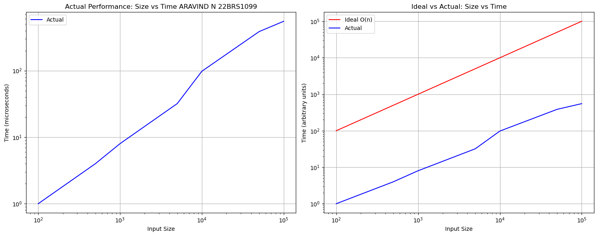
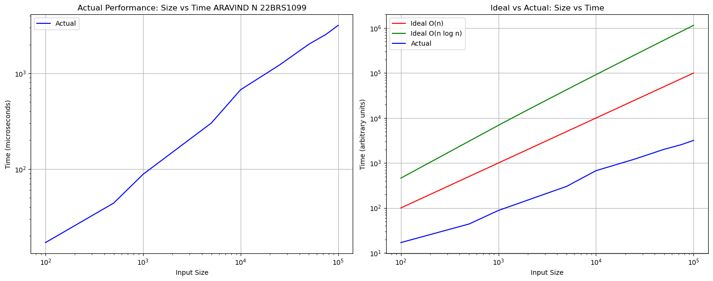
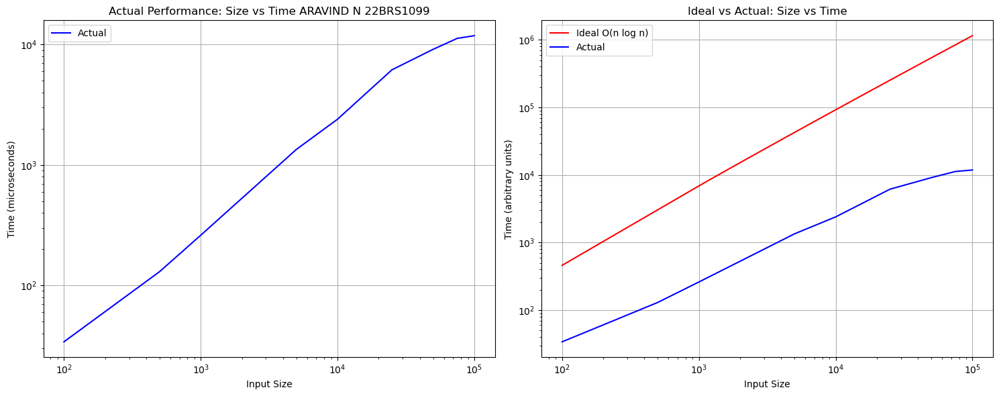
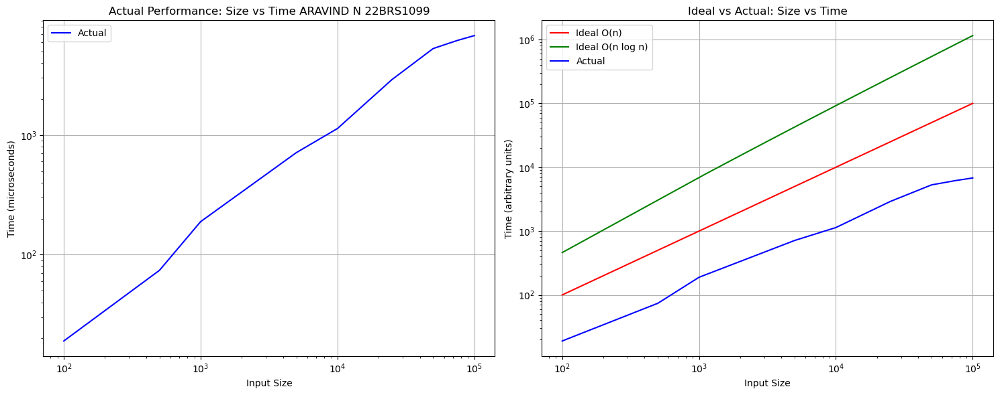
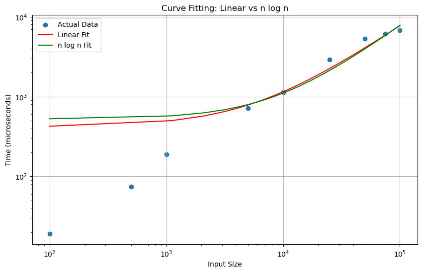
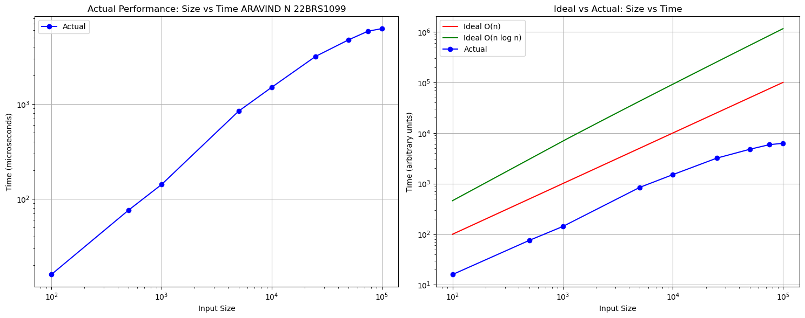
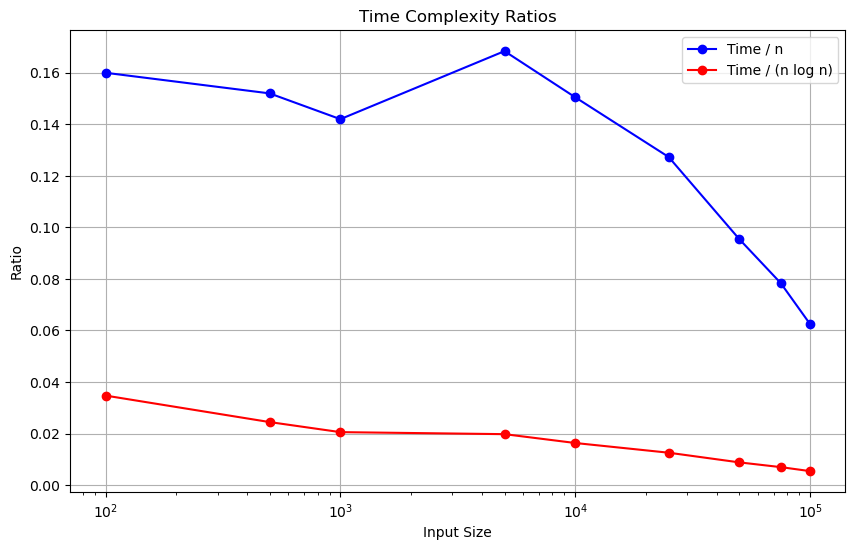

<h1 style="color:red;text-align:right">Aravind N 22BRS1099</h1>

# Lab 3: Maximum Sub Array 12/8/2024
## [Q1. Minimum value Minimum subarray Problem](q1/q1.cpp)
[Question.](<q1/Minimum value Minimum subarray Problem.md>)

Approximate experimental time complexity: O(n^0.95)

## [Q2. Minimum value Maximum Subarray Problem’](q2/q2.cpp)
[Question.](<q2/Minimum value Maximum subarray Problem.md>)

- Approximate experimental time complexity: O(n^1.02)
- Average ratio of actual time to n: 0.02

## [Q3. Maximum value Minimum subarray Problem](q3/q3.cpp)
[Question.](<q3/Max val min subarray.md>)

- Approximate experimental time complexity: O(n^0.78)
- Average ratio of actual time to n: 0.07
- Average ratio of actual time to n log n: 0.01

## [Q4. Maximum value Maximal subarray Problem- Different navigation on each part of subarray](q4/q4.cpp)
[Question.](<q4/Maximum value Maximal subarray Problem- Different navigation on each part of subarray.md>)

- Approximate experimental time complexity: O(n^0.88)
- Average ratio of actual time to n log n: 0.03

## [Q5. Maximum value Minimal non-negative subarray Problem](q5/q5.cpp)
[Question.](<q5/Max Value Minimal non neg sub.md>)

- Approximate experimental time complexity: O(n^0.87)
- R-squared for linear fit: 0.9471
- R-squared for n log n fit: 0.9326

- Average ratio (Time = n): 0.1284
- Average ratio (Time = (n log n)): 0.0173

## [Q6. Maximum value Maximal non-negative subarray Problem](q6/q6.cpp)
[Question.](<q6/Max value max non neg sub.md>)

- Approximate experimental time complexity: O(n^0.89)
- R-squared for linear fit: 0.9309
- R-squared for n log n fit: 0.9135

- Average ratio (Time = n): 0.1263
- Average ratio (Time = (n log n)): 0.0166

