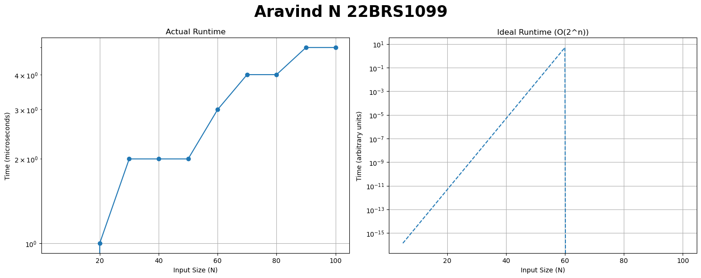
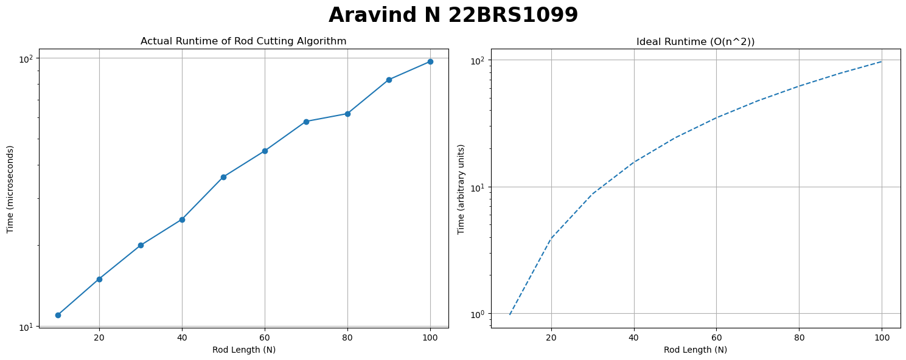
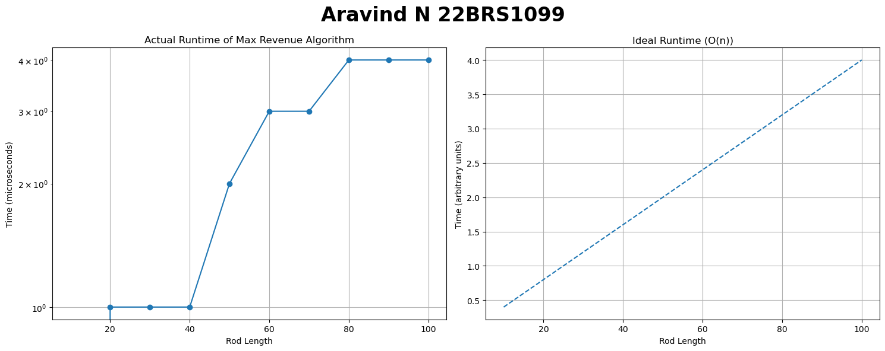
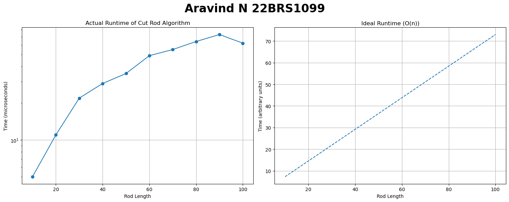

<h1 style="color:red;text-align:right">Aravind N 22BRS1099</h1>

# Lab 4: Recursion and Dynamic Programming Problems
## [Q1. My Fibanocci Term](q1/ans.cpp)
[Question.](q1/ques.md)

### Approx. Running Time with varying input size 
|   N |   Time (microseconds) |
|----:|----------------------:|
|   5 |                     0 |
|  10 |                     0 |
|  20 |                     1 |
|  30 |                     2 |
|  40 |                     2 |
|  50 |                     2 |
|  60 |                     3 |
|  70 |                     4 |
|  80 |                     4 |
|  90 |                     5 |
| 100 |                     5 |

(The graph is logarithmically scaled for better view)

## [Q2. Print Rod Lengths](q2/ans.cpp)
[Question.](q2/ques.md)
### Approx. Running Time with varying input size 
|   N |   Time (microseconds) |
|----:|----------------------:|
|  10 |                    11 |
|  20 |                    15 |
|  30 |                    20 |
|  40 |                    25 |
|  50 |                    36 |
|  60 |                    45 |
|  70 |                    58 |
|  80 |                    62 |
|  90 |                    83 |
| 100 |                    97 |

(The graph is logarithmically scaled for better view)

## [Q3. Cut into lengths 3 or 5](q3/ans.cpp)
[Question.](q3/ques.md)
### Approx. Running Time with varying input size 
|   Length |   Time (microseconds) |
|---------:|----------------------:|
|       10 |                     0 |
|       20 |                     1 |
|       30 |                     1 |
|       40 |                     1 |
|       50 |                     2 |
|       60 |                     3 |
|       70 |                     3 |
|       80 |                     4 |
|       90 |                     4 |
|      100 |                     4 |

(The graph is logarithmically scaled for better view)

## [Q4. Cut Rods of Preferred Lengths](q4/ans.cpp)
[Question.](q4/ques.md)
### Approx. Running Time with varying input size 
|   Length |   Time (microseconds) |
|---------:|----------------------:|
|       10 |                     5 |
|       20 |                    11 |
|       30 |                    22 |
|       40 |                    29 |
|       50 |                    35 |
|       60 |                    49 |
|       70 |                    55 |
|       80 |                    64 |
|       90 |                    73 |
|      100 |                    62 |

(The graph is logarithmically scaled for better view)
