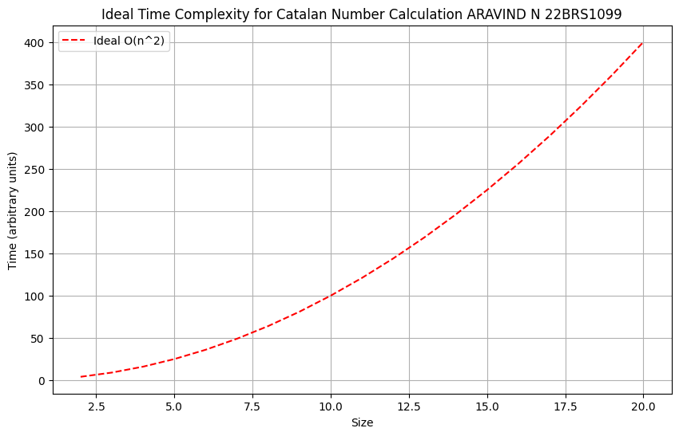
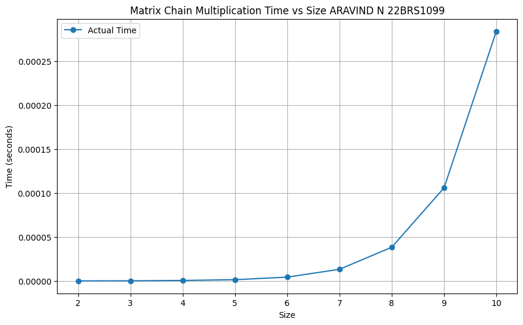
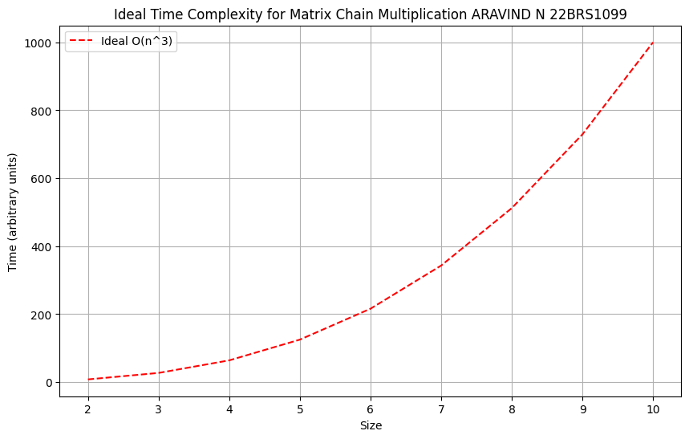
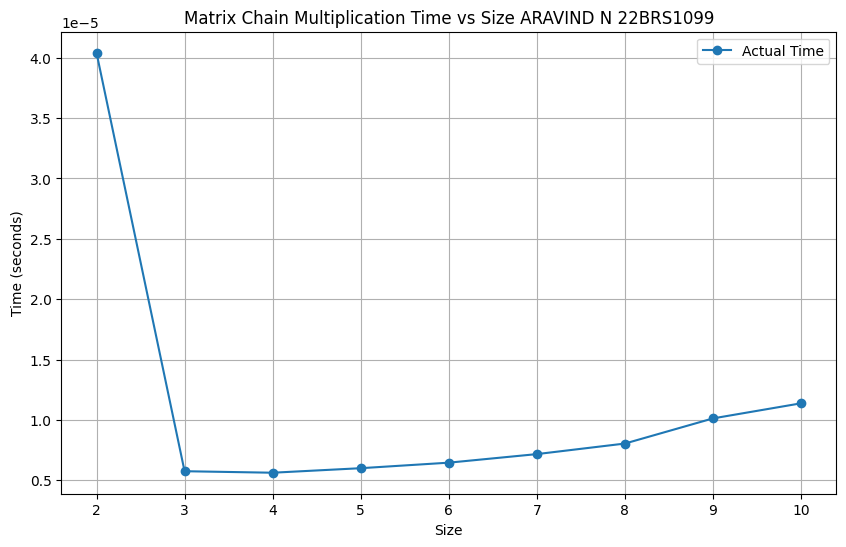
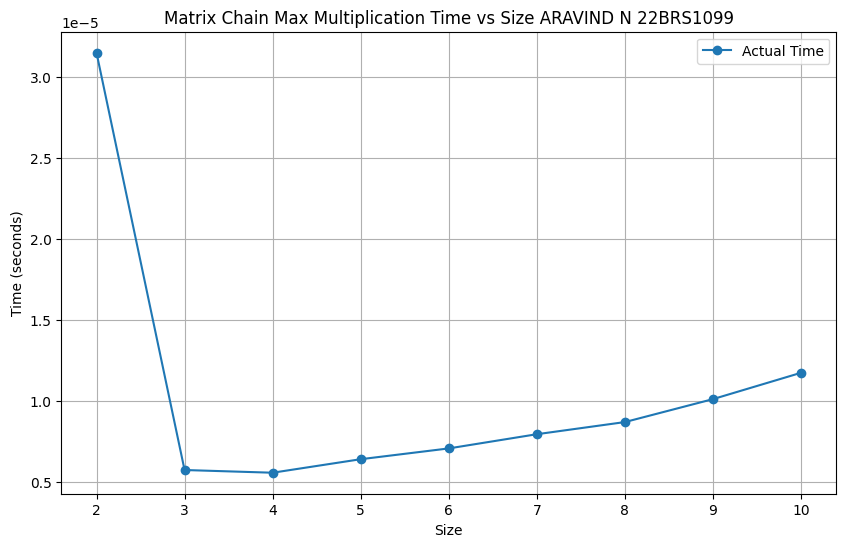

<h1 style="color:red;text-align:right">Aravind N 22BRS1099</h1>

# Lab 5 : Matrix Chain Multiplication
## [Q1. Number of ways to parenthesize](q1/ans.cpp)
[Question.](q1/q.md)

GRAPH (The graph shows high time for the initial size run because of System Overhead or Cache Warm-up)
    

        
        
    

## [Q2. Recursive Matrix Chain multiplication](q2/ans.cpp)
[Question.](q2/q.md)

GRAPH 
    

        
        
    

## [Q3. Matrix Chain Multiplication Top Down](q3/ans.cpp)
[Question.](q3/q.md)
 
 
 
GRAPH (The graph shows high time for the initial size run because of System Overhead or Cache Warm-up)
    

        
        
    

## [Q4. Maximum cost for matrix chain multiplication](q4/ans.cpp)
[Question.](q4/q.md)

GRAPH (The graph shows high time for the initial size run because of System Overhead or Cache Warm-up)
    

        
        
    
